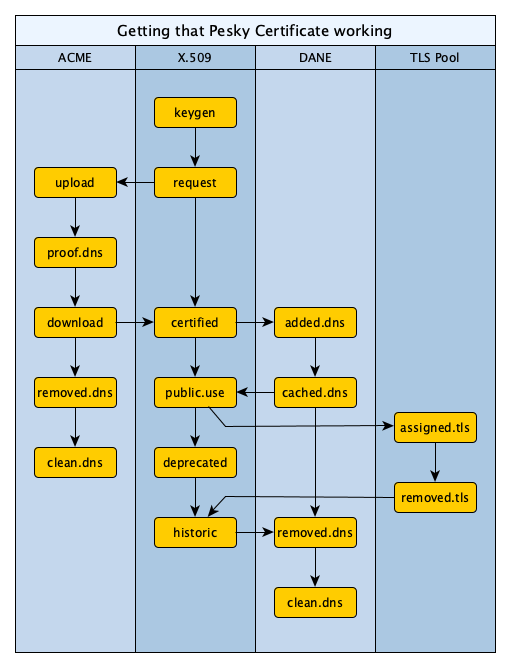

# Certification Flow

> *Although DANE and ACME are helpful protocols, and fit for automation,
> doing this well is far from straightforward.  We invented the idea
> of Life Cycle Management to accommodate it in a live, large-scale setup.*

The process for obtaining an X.509 certificate over ACME, while keeping
the interests of DANE in mind inclusive of DNS caching behaviour and the
strong reject of anything that is off during the time, is strongly
intertwined.  The additional requirement of automatically renewing keys
and serving all certificates as soon as possible but never too early
complicates things even further.  The diagram shows the ordering relations.

Arrows indicate time ordering.  The four columns are usually described in
isolation, and integrating it all is left as a gentle exercise to the
reader.  Keep in mind that errors can occur at any stage, and must be
handled with care.

The life Cycle Management system is made to define these steps, and
trigger independent processes to take a step whenever the prior actions
are completed.  The description of the diagram would be in a set of four
`lifecycleState` attribute values:

  * `x509 . keygen@ request@ acme?download certified@ dane?cached_dns public_use@ deprecated@ historic@`
  * `acme . x509?request upload@ proof_dns@ download@ removed_dns@ clean_dns@`
  * `dane . x509?certified added_dns@ cached_dns@ x509?historic removed_dns@ clean_dns@`
  * `tlspool . x509?public_use assigned_tls@ removed_tls@`

Note that the first word is a name, not an event.  So, these four
processes are all at the beginning, as indicated by the dot, but only
process `x509` can move.  The `?` indicate the time ordering arrows that
crossover between columns; arrows within the columns are taken care of by
their individual order.

After a number of steps, taking around 12345 seconds after the Epoch,
we might find an updated state as follows; note that time stamps have
been added to events, just to log their time of firing and to provide
a basis for retry timer calculations.

  * `x509 keygen@12345 request@12347 . acme?download certified@ dane?cached_dns public_use@ deprecated@ historic@`
  * `acme x509?request . upload@ proof_dns@ download@ removed_dns@ clean_dns@`
  * `dane . x509?certified added_dns@ cached_dns@ x509?historic removed_dns@ clean_dns@`
  * `tlspool . x509?public_use assigned_tls@ removed_tls@`

At this point, a key has been generated by the `keygen` event handler script,
followed by constructing a request in the `request` script.  The ACME process
can now continue by firing an `upload` event

  * `x509 keygen@12345 request@12347 acme?download . certified@ dane?cached_dns public_use@ deprecated@ historic@`
  * `acme x509?request upload@12348 proof_dns@12349 download@12359 . removed_dns@ clean_dns@`
  * `dane . x509?certified added_dns@ cached_dns@ x509?historic removed_dns@ clean_dns@`
  * `tlspool . x509?public_use assigned_tls@ removed_tls@`

After the `upload` event handler sees its work done, it updates the attribute
for `acme` accordingly, posting the obliged timestamp.  The machine rattles on,
running the `proof_dns` script to post a proof in DNS and supporting `download`
which not only brings the `acme` process forward, but the engine immediately
discovers that `x509` can also move beyond `acme?download`.

We are now about to run another event handler in the `x509` process, namely
`certified`.  This is retried on a regular basis, with exponential fallback,
until an event handler succeeds and updates the attribute for `x509` to go
behond the `certified` state by adding the timestamp and moving the dot.
Presumably, this process validates the certificate it downloaded, and perhaps
it downloads root or intermediate certificates.

In parallel to this certification taking place for `x509`, the `acme` process
can continue with the `removed_dns` event and, once this is done, it can also
trigger the `clean_dns` event handler.  Once these are both done, the `acme`
process is done, which is visible in its trailing dot.

Assuming that `x509` completes the `certified` process at the same time,
we get

  * `x509 keygen@12345 request@12347 acme?download certified@12420 . dane?cached_dns public_use@ deprecated@ historic@`
  * `acme x509?request upload@12348 proof_dns@12349 download@12359 removed_dns@ clean_dns@ . `
  * `dane . x509?certified added_dns@ cached_dns@ x509?historic removed_dns@ clean_dns@`
  * `tlspool . x509?public_use assigned_tls@ removed_tls@`

At this point, the `x509` process is stuck waiting for `dane` to continue.
Indeed, having seen that `x509?certified` has now been reached, the `dane`
process can continue and trigger the `added_dns` event handler, which will
publish the certificate in a `TLSA` record in DNS before advancing the dot
beyond that point.  And then it gets interesting.

The added `TLSA` record is not visible at the same time everywhere.  Some
systems have cached DNS data, and need to abide the accompanying TTL.  This
is [automated in arpa2dns](https://github.com/arpa2/arpa2shell/blob/master/src/arpa2dns/README.MD)
with a reported `Cache-Update-Delay` value.  Let's say it is 2000.  We can
then update the timestamp at which the next action takes place, even if it
is after the dot:

  * `x509 keygen@12345 request@12347 acme?download certified@12420 . dane?cached_dns public_use@ deprecated@ historic@`
  * `acme x509?request upload@12348 proof_dns@12349 download@12359 removed_dns@ clean_dns@ . `
  * `dane x509?certified added_dns@12440 . cached_dns@14440 x509?historic removed_dns@ clean_dns@`
  * `tlspool . x509?public_use assigned_tls@ removed_tls@`

Clearly, `x509` cannot continue until the TTL has expired either, because
`dane` needs to progress its dot beyond the `cached_dns` state first.
Once these two things have happened, the `x509` process free the certificate
for `public_use`, which is merely a time stamping event with no side effects.
The `tlspool` process however, picks up on it and assigns the certificate
for use with TLS, and patiently awaits future deletion, for which it sets
the time stamp at the certificate expiration time.  We then have:

  * `x509 keygen@12345 request@12347 acme?download certified@12420 dane?cached_dns public_use@14444 . deprecated@28000 historic@28888`
  * `acme x509?request upload@12348 proof_dns@12349 download@12359 removed_dns@ clean_dns@ . `
  * `dane x509?certified added_dns@12440 cached_dns@14440 . x509?historic removed_dns@ clean_dns@`
  * `tlspool x509?public_use assigned_tls@14444 . removed_tls@28888`

Note how the `x509` event for `public_use` has taken the opportunity of
setting a time of deprecation for the certificate, well in time to get a
new one, and a historic timestamp equal to the certificate expiration.

## Drivers

The four Life Cycles each start their own driver.  At each stage, they will
skip any `?` events because these will have been passed in Life Cycle
Management, as that is its responsibility.  So the first `@` event after
the dot is what a driver should look for.  Any time written there may be
assumed to have passed.  If no time is shown, processing took care as soon
as possible.

The driver can move the dot beyond this point, and perhaps further, while
annotating the time on each `@` that does not have one at the time that
the dot jumps over it.

Drivers may also learn about future timestamps, and add those to
`@` events after the dot.  An example is
[learning about DNS delays](https://github.com/arpa2/docker-demo/tree/master/demo-dns#learning-about-dns-cache-timing)
while inserting data for DANE or ACME, and setting an appropriate
time for it; this applies to `cached_dns@` and `clean_dns@`
for example and, depending on the ACME implementation, it may also
define the first certain-to-work `proof_dns@` timing.  When such times
are set, the Life Cycle Management code will be sure not to fire at
any earlier time.  Other good examples in the X.509 column are setting
`deprecated@` and `historic@` to times depending on the requests, and
later overridden by the certificates, `notBefore` and `notAfter`
attributes.

## Success and Failures

When successful, the new attribute value can be sent to LDAP as a
replacement for the old value.  This will retract the old value from
Life Cycle Management and insert the new one as though it was a fresh
new value.  Though the entire attribute value might be replaced at this
point, you should really know what you are doing if you intend to use
that.  While updating the `lifecycleState` attributes, the other
attributes in the same object in LDAP might also be changed.  This
allows for storage of intermediate results alongside the `lifecycleState`
attributes.

Failures should be handled atomically.  That is, everything succeeds
or everything fails.  So there should be no uploads, no storage used,
and so on.  The failure is not reported back to Life Cycle Management;
it will simply continue to trigger a driver with exponential fallback
until the attribute is removed from LDAP by a success.  Note that any
changes to a single LDAP object is always atomic; when you store your
data alongside the `lifecycleState` attributes you should have no
problems with an atomic implementation.

Important to realise is that these attempts must be idempotent: doing
the same thing again makes no difference.  This will often be the case
if LDAP is not updated.

## Simple and Powerful

This system appears to be (just) powerful enough to create the
kind of complex processes that seem to be required here.  In spite
of the expressive power, it is not that complex.  That's always a
winning combination.

## Accurate and Flexible

The sytem is accurate, but also flexible.  Administrators may choose
any implementation they like for the various components.  And they may
want to add or remove columns, thereby complicating or simplifying the
interdependencies.  The simple text format however, allows terse and
concise descriptions of the process to follow.

As an example, consider a self-signed certificate.  The ACME column
would be removed and another put in its place.  It will still bring
the certificate from `request` to `certified` but with other steps
in the new columns that describes self-signatures.

As another example we used a `TLS Pool` server, but that would not
be possible everywhere.  Even when the process looks the same, with
`configured` and `removed` steps, the implementation may differ.
This is easily arranged by calling on another driver, which can
implement a completely different logic.  Where it is possible, the
TLS Pool can be really helpful in automating the flow of certificates
through one's systems; it has been designed to integrate with this
kind of automation.

